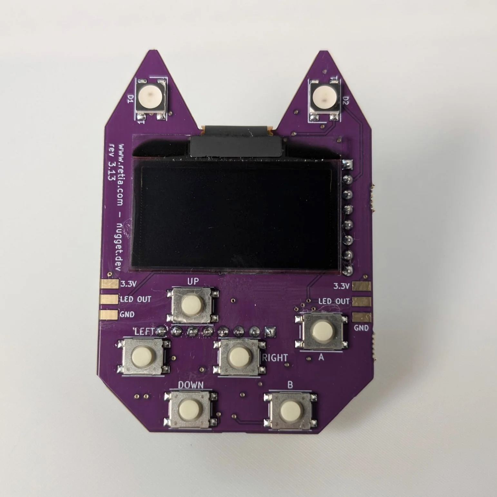
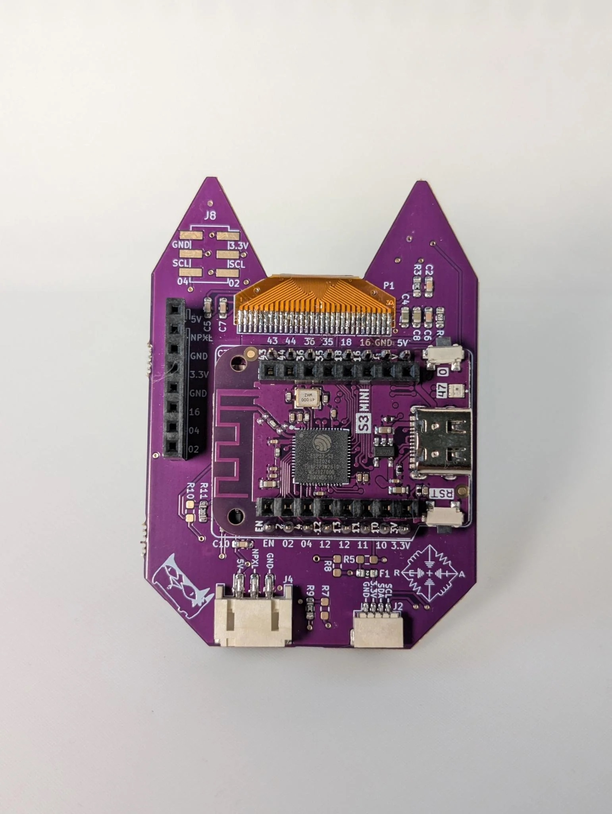
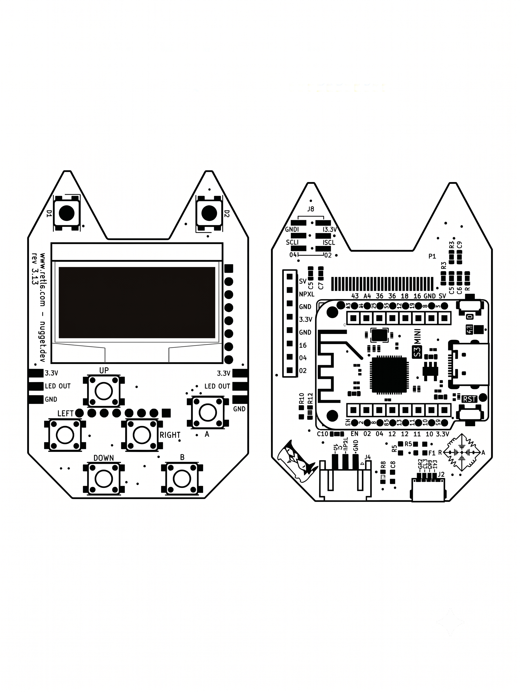

# Bluetooth Nugget — ESP32-S3

Flashable firmware for the Retia **Bluetooth Nugget** that does something fun and useful
**with no LoRa backpack required.** Surveillance detectors, a Wi-Fi foxhunt tool, an
LED-art controller, an 8-game arcade, an AirTag scanner, and the full ESP32 Marauder
suite — all on the bare board.

> Want the LoRa mesh side (Meshtastic) too? That still needs the RFM95 backpack. Everything
> in this repo runs on the Nugget by itself.

<p align="center">
  
  
</p>

## One-click flashing

The easiest path is the browser flasher — no tools to install, just Chrome/Edge and a USB cable:

### 👉 https://scriptkitty.sh  (pick "Bluetooth Nugget")

Prefer the command line? Every image here is a single merged file flashed at `0x0`:

```bash
pip install esptool
esptool --chip esp32s3 --port <PORT> write-flash 0x0 firmware/<name>.factory.bin
```

`<PORT>` is `/dev/cu.usbmodem*` (macOS), `/dev/ttyACM0` (Linux), or `COMx` (Windows).

## What's on the board

| | |
|---|---|
| MCU | **ESP32-S3FH4R2** (LOLIN/Wemos S3 Mini) — dual-core 240 MHz, Wi-Fi + BLE 5, **4 MB flash**, **2 MB QSPI PSRAM**, native USB |
| Display | **128×64 I²C OLED** (SH1106/CH1116, SSD1306-compatible), addr `0x3C`, SDA=GPIO35 / SCL=GPIO36 |
| Input | **6 buttons** — UP=13, DOWN=18, LEFT=11, RIGHT=12, A=44, B=43 — plus BOOT (GPIO0) |
| Blinkies | **2× WS2812 NeoPixel** "ears" on GPIO10 |
| Radio | *(optional)* RFM95W **LoRa** backpack — not used by any firmware here |
| Expansion | QWIIC / I²C (35/36), SAO v2, accessory headers |

## The firmware

| Firmware | What it does | Screen | Controls |
|---|---|---|---|
| **OUI-SPY** | 4-in-1 **passive surveillance detector** — Flock Safety ALPR + ShotSpotter/Raven, drone Remote-ID, a BLE device watchlist, and an RSSI **foxhunt** — pick a mode on the screen or over Wi-Fi | ✅ OLED | Button menu + web |
| **WiFi Analyzer** | **Passive Wi-Fi survey + device hunter** — browse nearby networks, then pick one for a live RSSI meter (with the ears blinking blue→red-hot) to walk it down | ✅ OLED | Buttons |
| **WLEDkitty** | WLED for Retia devices — drives the onboard RGB ears + external strips, **boots into a Pride rainbow**, live status on the OLED, on-device brightness/color control | ✅ OLED | Buttons + web |
| **Retro Arcade** | **8 retro games** — Snake, Tetris, Breakout, Pac-Man, Flappy, 2048, Frogger, Helicopter | ✅ OLED | d-pad + A/B |
| **AirTag Scanner** | **Passive AirTag / Find-My** unwanted-tracker detector — live count + last tag on the OLED, full log over serial | ✅ OLED | — |
| **ESP32 Marauder** | The **ESP32 Marauder** Wi-Fi/Bluetooth analysis + testing suite — runs headless, driven over USB serial | serial | serial CLI |

All images are hardware-validated on real Bluetooth Nuggets and ship as merged `0x0`
factory images (bootloader + partitions + app in one file).

## Hardware & docs

- **[docs/pinout.md](docs/pinout.md)** — full GPIO map (OLED, buttons, NeoPixel, connectors, LoRa backpack)
- **[hardware/bluetooth-nugget-schematic-v3.14.pdf](hardware/bluetooth-nugget-schematic-v3.14.pdf)** — schematic
- **[hardware/board-outline-rev03.dxf](hardware/board-outline-rev03.dxf)** — mechanical board outline (DXF) + [board-art.svg](hardware/board-art.svg)

*(KiCad project sources aren't published yet — schematic PDF + outline only for now.)*

<p align="center"></p>

## Build your own

New to the board? The **[examples/](examples)** folder has bare-bones Arduino sketches for
the OLED, the buttons, the NeoPixel "ears", and a Wi-Fi scan — a starting point for your
own firmware.

## Repo map

```
firmware/                       6 flashable factory images (merged, flash at 0x0)
  oui-spy.factory.bin           OUI-SPY 4-in-1 passive detector (OLED + buttons)
  wifi-analyzer.factory.bin     Wi-Fi survey + foxhunt device hunter (OLED + NeoPixel ears)
  wled.factory.bin              WLEDkitty — WLED for Retia, Pride rainbow (OLED + buttons)
  retro-arcade.factory.bin      8-game arcade (OLED + d-pad/A/B)
  airtag-scanner.factory.bin    Passive AirTag / Find-My detector (OLED)
  marauder.factory.bin          ESP32 Marauder Wi-Fi/BT suite (headless/serial)
hardware/                       schematic PDF + board outline (DXF/SVG)
docs/pinout.md                  the GPIO map
examples/                       Arduino starter sketches (OLED, buttons, ears, Wi-Fi)
images/                         board photos
```

## Sources & credits

These are built from excellent open-source projects, adapted to the Bluetooth Nugget's
pins (OLED on 35/36, NeoPixel on 10, the six buttons) and its 4 MB / QSPI-PSRAM chip:

- OUI-SPY & the Flock/Raven + drone detection — [colonelpanichacks/oui-spy-unified-blue](https://github.com/colonelpanichacks/oui-spy-unified-blue) / [flock-you](https://github.com/colonelpanichacks/flock-you)
- WLED — [wled/WLED](https://github.com/wled/WLED)
- Retro Arcade — [nturmose21/MiniGames](https://github.com/nturmose21/MiniGames)
- AirTag Scanner — [MatthewKuKanich/ESP32-AirTag-Scanner](https://github.com/MatthewKuKanich/ESP32-AirTag-Scanner)
- Wi-Fi Analyzer — based on [hackffm/ESP32_OLED_WifiScanner](https://github.com/hackffm/ESP32_OLED_WifiScanner), extended with the foxhunt hunter
- ESP32 Marauder — [justcallmekoko/ESP32Marauder](https://github.com/justcallmekoko/ESP32Marauder)

## Use responsibly

The detectors here are **passive** — they only listen, and are meant for privacy and
surveillance awareness. **ESP32 Marauder includes active Wi-Fi/Bluetooth testing tools
(deauth, beacon spam, evil portal); only use them on networks and devices you own or have
explicit written permission to test.** Many active features are illegal to use against
others and may be illegal to transmit on some bands in your region — know your local laws.

— [Retia](https://retia.io)
