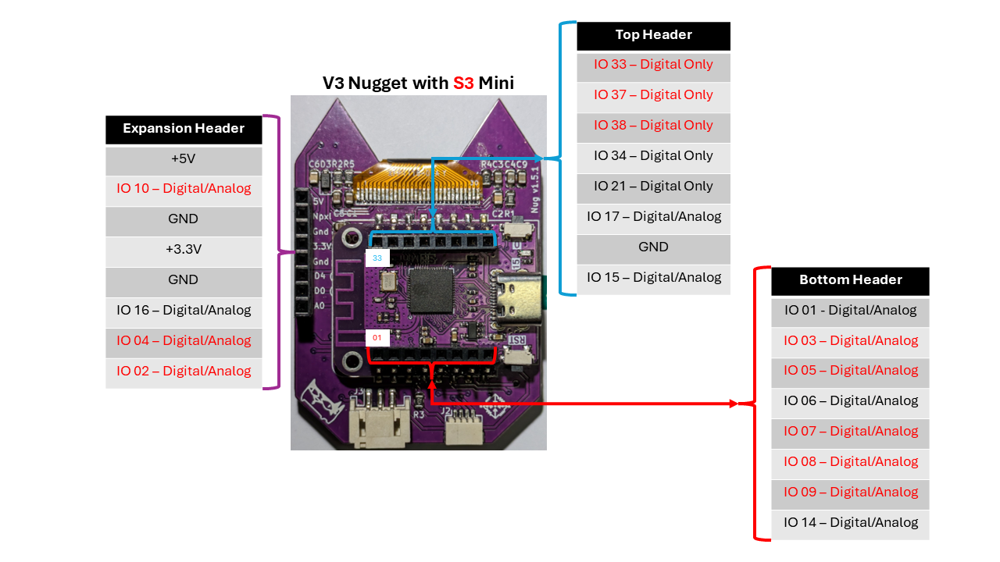

# Bluetooth Nugget — pinout (rev 3.x)

The Bluetooth Nugget is a **LOLIN/Wemos S3 Mini** (ESP32-S3FH4R2) socketed onto the
cat-shaped Nugget PCB. This is the GPIO map the firmware in this repo uses.

> The tables below are the **firmware-validated** pins for the on-board OLED, buttons, and
> NeoPixel (confirmed working on hardware). The diagram above is the expansion / top / bottom
> **header** breakout reference.

## On-board peripherals

| Peripheral | Part | GPIO | Notes |
|---|---|---|---|
| **OLED display** | 128×64 I²C (SH1106/CH1116, SSD1306-compatible) | **SDA = GPIO35, SCL = GPIO36** | I²C address `0x3C`. Mounted 180° — set the driver to rotation-2 / flip (SSD1306 driver renders with no column offset). |
| **Button UP** | tactile, active-low | **GPIO13** | pulled up |
| **Button DOWN** | tactile, active-low | **GPIO18** | pulled up |
| **Button LEFT** | tactile, active-low | **GPIO11** | pulled up |
| **Button RIGHT** | tactile, active-low | **GPIO12** | pulled up |
| **Button A** | tactile, active-low | **GPIO44** | pulled up (also UART0 RX) |
| **Button B** | tactile, active-low | **GPIO43** | pulled up (also UART0 TX) |
| **BOOT** | on the S3 Mini module | **GPIO0** | usable as a 7th button |
| **RGB "ears"** | 2× WS2812 (D1 = left, D2 = right) | **GPIO10 (data)** | chainable out to J4 for more pixels |

> All six face buttons read `LOW` when pressed. Use `pinMode(pin, INPUT_PULLUP)`.

## Header pins

Each pin-header edge has **two rows**: an **inner female** row that carries the S3 Mini's own
pins (mirrored from the LOLIN S3 Mini pinout) and an **outer male** row. The **inner female**
rows are the accessible ones — they're what the backpack add-ons tap — so those are the ones
to wire to. The outer male rows aren't easily accessible and aren't used by add-ons.

| Inner-female header | Pins, in order |
|---|---|
| **Top** | IO33 · IO37 · IO38 · IO34 · IO21 · IO17 · GND · IO15 |
| **Bottom** | IO01 · IO03 · IO05 · IO06 · IO07 · IO08 · IO09 · IO14 |
| **Expansion (left edge)** | 5V · IO10 · GND · 3.3V · GND · IO16 · IO04 · IO02 |

The RFM95 LoRa backpack taps **IO6/7/8/9** on the Bottom row and **IO16/04** on the Expansion
row. See [BluetoothNugget.png](../images/BluetoothNugget.png) above for the visual layout.

## Other connectors

| Connector | Pins |
|---|---|
| **J2 — QWIIC / I²C** | SCL = GPIO36 · SDA = GPIO35 · 3.3V · GND (same bus as the OLED) |
| **J4 — external NeoPixel** | 5V · **NPXL = GPIO10** · GND (level-shifted 5V data for an off-board strip) |
| **J8 — SAO v2** | GND · 3.3V · SDA(GPIO35) · SCL(GPIO36) · GPIO04 · GPIO02 |
| **LED-out pads** (both ears) | 3.3V · LED OUT (GPIO10 chain) · GND |

## Optional RFM95 LoRa backpack

Not used by any firmware in this repo, but for reference the backpack taps:

| Signal | GPIO |
|---|---|
| SCK | 6 |
| MISO | 7 |
| MOSI | 8 |
| CS / NSS | 9 |
| DIO0 / IRQ | 16 |
| RESET | 4 |

The backpack plugs into the inner-female headers for these (IO6/7/8/9 on the Bottom row,
IO16/04 on the Expansion row). It deliberately avoids the button/OLED pins, so the buttons
stay live while LoRa runs.

## GPIO for your own projects

Broken out on the inner-female headers: **IO 1, 3, 5, 6, 7, 8, 9, 14, 15, 17, 21, 33, 34, 37,
38** (Top/Bottom rows) plus **IO16, IO04, IO02** and **IO10** (NeoPixel-out) on the Expansion
row. Used internally and **not** on the user headers: **11/12/13/18/43/44** (buttons) and
**35/36** (I²C/OLED). IO 6/7/8/9/16/4 double as the LoRa backpack bus.

## Build target

- **PlatformIO:** `board = lolin_s3_mini`, `board_build.arduino.memory_type = qio_qspi`, `-D ARDUINO_USB_CDC_ON_BOOT=1`
- **Arduino IDE / arduino-cli:** board **"LOLIN S3 Mini"** (`esp32:esp32:lolin_s3_mini`); Flash 4 MB, PSRAM **QSPI**, USB CDC On Boot **Enabled**
- It enumerates over **native USB** (`/dev/cu.usbmodem*`); the console is USB-CDC serial at 115200.
